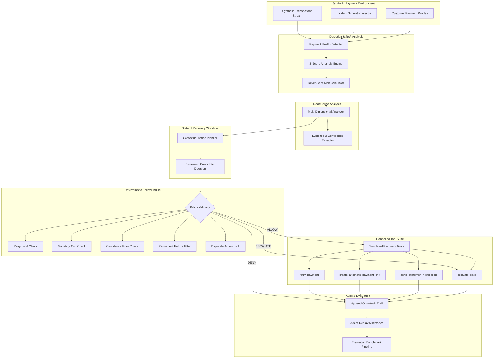

# RecoverAI — System Architecture & Control Boundary

**Track:** Razorpay Buildathon — Track 03: AI Revenue Recovery  
**Product:** RecoverAI — Autonomous, Bounded Payment Recovery Agent

---

## 1. Core Architectural Principle

The fundamental architectural safety rule of RecoverAI is:

```
┌─────────────────────────────────────────────────────────┐
│                    AI AGENT LAYER                       │
│    - Evaluates incident context & transaction signals   │
│    - Contextual diagnosis & reasoning generation        │
│    - Proposes candidate action & confidence score       │
└────────────────────────────┬────────────────────────────┘
                             │ Proposes Candidate Action
                             ▼
┌─────────────────────────────────────────────────────────┐
│        DETERMINISTIC FINANCIAL POLICY ENGINE            │
│    - Retry Limit Guardrail (MAX_RETRIES = 2)            │
│    - Monetary Threshold (Limit: ₹50,000 / 5M paise)     │
│    - Confidence Floor Threshold (Min: 0.80)             │
│    - Permanent Failure Safeguard (Zero blind retries)   │
│    - Duplicate In-Flight Action Lock                    │
│    - Success & Customer-Decline Stopping Conditions     │
│    Decision: ALLOW  |  DENY  |  ESCALATE                │
└────────────────────────────┬────────────────────────────┘
                             │ Validated / Approved Action Only
                             ▼
┌─────────────────────────────────────────────────────────┐
│              CONTROLLED EXECUTION TOOLS                 │
│    - retry_payment()                                    │
│    - create_alternate_payment_link()                    │
│    - send_customer_notification()                       │
│    - escalate_case()                                    │
└────────────────────────────┬────────────────────────────┘
                             │ Simulated Outcome Result
                             ▼
┌─────────────────────────────────────────────────────────┐
│             VERIFICATION & IMMUTABLE AUDIT              │
│    - Ground truth outcome verification                  │
│    - Exact minor-unit currency accounting (paise)       │
│    - Append-only audit record & step-by-step replay     │
└─────────────────────────────────────────────────────────┘
```

> [!IMPORTANT]
> The AI Agent **cannot** bypass the Deterministic Policy Engine. Financial calculations, retry count limits, monetary thresholds, and stopping conditions are strictly evaluated in deterministic code, never by free-form LLM output.

---

## 2. End-to-End System Architecture



---

## 3. Stateful Agent Lifecycle Stages

The recovery workflow operates across 8 strictly sequenced phases:

1. **`DETECT`**: Statistical anomaly detector evaluates current transaction cohort against historical baseline (93.5% success rate). Calculates z-score, percentage point degradation, and gross revenue at risk in integer paise.
2. **`DIAGNOSE`**: Root cause engine segments failure dimensions across payment rails (`UPI`, `CARD`, `NETBANKING`), providers (`HDFC`, `ICICI`, `SBI`, `RAZORPAY`), bank switches, and error codes (`UPI_TIMEOUT`, `NETWORK_DISCONNECT`, `BANK_SWITCH_BUSY`). Produces grounded evidence bullets and diagnostic confidence.
3. **`IDENTIFY_AFFECTED_TRANSACTIONS`**: Segments the failed cohort into candidate recoverable transactions vs terminal permanent failures.
4. **`PLAN`**: Contextual decision model proposes intervention (`RETRY`, `ALTERNATE_PAYMENT`, `CUSTOMER_NUDGE`, `WAIT_AND_RETRY`, `ESCALATE`, `NO_ACTION`) tailored to customer profile and failure reason.
5. **`VALIDATE_POLICY`**: Policy engine inspects every proposal against deterministic financial rules.
6. **`EXECUTE`**: For approved actions, dispatches the designated controlled tool against simulated payment switch.
7. **`VERIFY`**: Verifies transaction state transition (`SUCCESS`, `FAILURE`, `ESCALATED`, `BLOCKED`) and captures paise-exact recovered revenue.
8. **`MEASURE & COMPLETE`**: Emits immutable audit records, updates incident recovery totals, and generates chronological replay steps.

---

## 4. Deterministic Financial Guardrails

| Guardrail Rule | Parameter Value | Action on Violation | Rationale |
|---|---|---|---|
| **Max Retry Limit** | `MAX_RETRIES = 2` | `DENY` | Prevents cascading gateway retries and banking switch rate limits. |
| **Monetary Threshold** | `AUTONOMOUS_LIMIT = ₹50,000` | `ESCALATE` | High-value payments require VIP merchant operations oversight. |
| **Confidence Floor** | `MIN_CONFIDENCE = 0.80` | `ESCALATE` | Prevents autonomous actions when root cause or profile is ambiguous. |
| **Permanent Decline Safeguard** | `PERMANENT_CATEGORY` | `DENY` | Prohibits retrying invalid accounts, stolen cards, or closed banks. |
| **Duplicate Action Lock** | Active In-Flight Set | `DENY` | Prevents double-charging or simultaneous duplicate actions. |
| **Success Stop Condition** | `is_recovered == True` | `DENY` | Halts any further recovery once payment is settled. |
| **Customer Decline Stop** | `customer_declined == True`| `DENY` / `ESCALATE` | Respects explicit customer opt-out. |

---

## 5. Currency Precision & Minor Units

All financial accounting internally uses **integer minor units (paise)**:
- ₹1.00 = 100 paise
- ₹2,499.50 = 249,950 paise
- ₹50,000.00 = 5,000,000 paise

Formatting to ₹ (INR) occurs solely at UI and API presentation boundaries, guaranteeing zero floating-point accumulation drift during evaluation aggregations.
